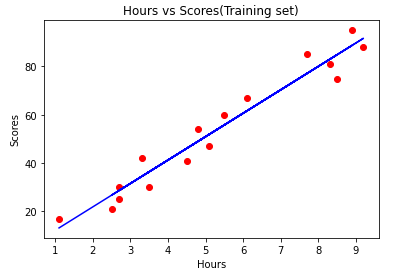
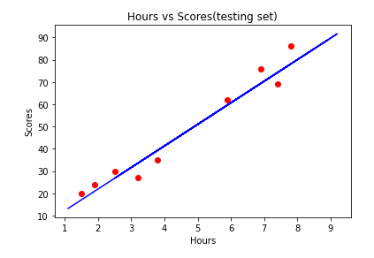

# Implementation-of-Simple-Linear-Regression-Model-for-Predicting-the-Marks-Scored

## AIM:
To write a program to implement the simple linear regression model for predicting the marks scored. 

## Equipments Required: 
1. Hardware – PCs
2. Anaconda – Python 3.7 Installation / Moodle-Code Runner 

## Algorithm
1. Import the required Libraries. 
2. Import the csv file.
3. Declare X and Y values with respect to the dataset.
4. Plot the graph using the matplotlib library.
5. Print the plot.
6. End the program.


## Program:
```
/*
Program to implement the simple linear regression model for predicting the marks scored.
Developed by: Javith farkhan.S
RegisterNumber: 212221240017 
*/
```
import numpy as np
import pandas as pd
import matplotlib.pyplot as plt
dataset=pd.read_csv('student_scores.csv')
dataset.head()
x=dataset.iloc[:,:-1].values
x
y=dataset.iloc[:,1].values
y
from sklearn.model_selection import train_test_split
x_train,x_test,y_train,y_test=train_test_split(x,y,test_size=1/3,random_state=0)
from sklearn.linear_model import LinearRegression
reg=LinearRegression()
reg.fit(x_train,y_train)
y_pred=reg.predict(x_test)
y_pred
y_test
plt.scatter(x_train,y_train,color='red')
plt.plot(x_train,reg.predict(x_train),color='blue')
plt.title("Hours vs Scores(Training set)")
plt.xlabel("Hours")
plt.ylabel("Scores")
plt.show()
plt.scatter(x_test,y_test,color='red')
plt.plot(x_train,reg.predict(x_train),color='blue')
plt.title("Hours vs Scores(testing set)")
plt.xlabel("Hours")
plt.ylabel("Scores")
plt.show()

```

## Output:
 



## Result:
Thus the program to implement the simple linear regression model for predicting the marks scored is written and verified using python programming.
